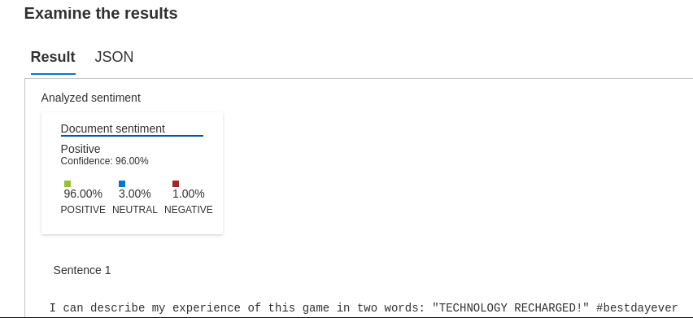
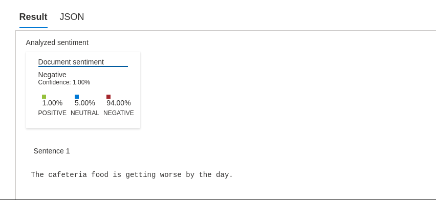

# Análise de Sentimentos com Language Studio no Azure AI

### Acesso o portal do Speech:

- ⚡ Acessei o portal do Speech em https://speech.microsoft.com/portal utilizando minhas credenciais da Microsoft.

* Selecionei "+ Criar um recurso" e pesquisei por "AI + Machine Learning".

- ⚡ Acessei o Azure AI Speech studio:

* Iniciei o Azure AI Speech studio

Fiz login no Azure AI Speech studio utilizando minha conta da Microsoft e fechei quaisquer mensagens que foram exibidas.

- ⚡ Visualizei o meu workspace:

No Azure AI Speech studio, visualizei o workspace e em seguida, selecionei o workspace que acabei de criar.

- ⚡ Visualizei o meu workspace e selecionei:

- ⚡ Acessei o portal do Speech em https://language.cognitive.azure.com/ utilizando minhas credenciais da Microsoft.

* Selecionei "Classify text".

* Selecionei "Analyze sentiment and opinions".

* Pedi pra rodar uma sentença e examinei os resultados:

